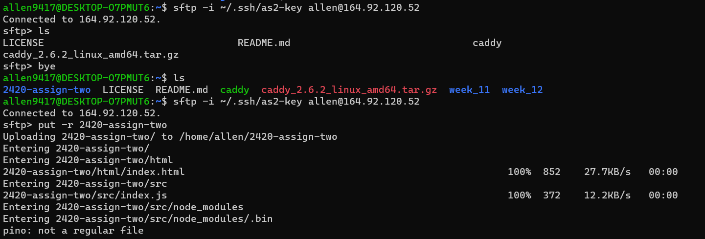
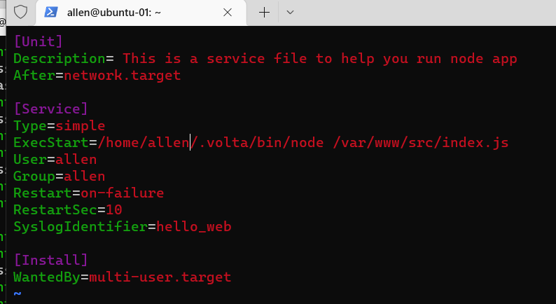

# ACIT 2420 Linux Assignment 2

Completed by Hao Li A01158483

> **note** load balancer IP : http://24.199.70.229/

## This README.MD guides how to do the following:

1. Create VPC
2. Create a new load Balancer with 2 droplets
3. Using sftp to tansfer your files from host-machine to a server
4. Setting up friewall using DO Firewall
5. Create a new regular user on both droplets
6. Install a Web server on both of your droplets(Caddy)
7. Write a simple "web app"
8. Installing node and npm with Volta
9. Testing load banlancer

## Resources/Technologies Used

- WSL - Windows Subsystem for Linux (Ubuntu)
- DigitalOcean Droplets
- Windows Terminal (with Administrative Privileges)
- Volta to install node
- Fastify for your NodeJS server

## Prerequisites and Assumptions (DigitalOcean and WSL setup)

**Note:** The following videos are assumed to be watched. Videos includes specific commands when setting up DigitalOcean Droplets, VPC, load Balancer and Firewall. The setup instructions below are to be done once the user has watched the video.

Follow along the embedded video to setup [DigitalOcean Droplets](https://vimeo.com/758870226/f75da348fc?embedded=true&source=video_title&owner=17609105)

Follow along the embedded video to setup [VPC, load Balancer, Firewall](https://vimeo.com/775412708/4a219b37e7)

**Note:**
Please watch all videos and finised setting up before you create the new user

## Step One

1. Follow the second video and create VPC

   

2. Follow the second video and create load Balancer

   **Note:** You should generate a new SSH key before you create 2 new droplets and copy paste key as public key.

   
   

   
   

   
   

   
   

   
   

3. Follow the second video and create Firewall

   

   

   

   

## Step Two: Create a regular user on both droplets

**Note:** You can use the same user-name and password for both droplets, this will make your life easier.

1. First login to both droplets as default(root) using command:

```
ssh -i ~/.ssh/keyname root@IPAddress
```


2. Create new user add user to the sudo group and set password do the command below:

```
useradd -ms /bin/bash username
```

```
usermod -aG sudo username
```

```
passwd username
```


3. Using rsync move new user using command below:

```
rsync --archive --chown=username:username ~/.ssh /home/username
```


4. Do the above steps to both droplets and you are done.

5. login to both droplets as new user

```
ssh -i ~/.ssh/keyname username@IPAddress
```


## Step 3: Install Web server(Caddy) to both droplets

1. Update and upgrade packages

```
sudo apt update && sudo apt upgrade
```


2. Downloading caddy at terminal line run:

   ```
   wget https://github.com/caddyserver/caddy/releases/download/v2.6.2/caddy_2.6.2_linux_amd64.tar.gz
   ```

   

3. Unzip caddy run command:

```
tar xvf caddy_2.6.2_linux_amd64.tar.gz
```


4. Change the caddy file's owner and group to root run command:

```
sudo chown root: caddy
```


5. Copy the caddy file to bin directory

```
sudo cp caddy /usr/bin/
```


**Note** Don’t configure them yet, we will do that later

## Step 4 Write you own "web app"


1. Create a new directory on your local machine (WSL for the windows people) 2420-assign-two might be a good name for this directory.


2. Inside of this directory create 2 new directories html and src.


3. Inside of the html directory create an index.html page


**note** create a simple but complete html document (include a doctype, head, body… all the stuff an html document should have).


4. Inside of the `src` directory create a new node project using volta do the follwowing command:

```
curl https://get.volta.sh | bash
source ~/.bashrc
volta install node
npm init
npm install fastify
```


5. create a `index.js` file


6. You can try to run and test it, open a new terminal.


7. Using sftp transfer your files to both droplets using command:

   i: To connect to remote server, run command:

```

sftp -i ~/.ssh/publickey username@remote-server-IP-address

```

ii: To upload folder you downloaded from the repo, in sftp, run command:

```

put -r folder-name

```




8. Move your files to correct directories for both droplets

1. move `index.html`


check


**note** make sure your 2 html have different structure so when you testing you can see the different!

2. move `src`


## Step 5 Caddy file

1. Go back to you local machine(WSL), create Caddyfile


2. Again using sftp transfer your file to both droplets make sure the path is correct


check


3. In both your droplets, move the `Caddyfile` to the `/etc/caddy` directory.

   

   

   
   

## Step 6 installing node and npm with Volta for both of your droplets.

```
curl https://get.volta.sh | bash
source ~/.bashrc
volta install node
volta install npm
```


2. **_note_** make sure you do those steps to both droplets

## Step 7 write a service file on your local machine to start your node application.

## Your service file should restart the service on failure.

1. Go back to WSL create a caddy.service file first


2. Using sftp transfer caddy.service file to both droplets make sure is in `/etc/systemd/system/` which all service files should be


3. In both your droplets, start and enable the Caddy service.

```
sudo systemctl daemon-reload
sudo systemctl start caddy
sudo systemctl enable --now caddy
sudo systemctl status caddy

```


4. Go back to WSL create node service file `hello_web.service` in same folfer.

   
   
   

5. Using sftp transfer node service file

   
   
   

6. move the service file to `/etc/systemd/system/` folder

   
   

7. Start and enable the node service.

```
sudo systemctl daemon-reload
sudo systemctl start hello_web
sudo systemctl enable --now hello_web
```


## Step 8 Testing, check load banlancer

1. Unbuntu-01


2. Unbuntu-02


3. Api route


